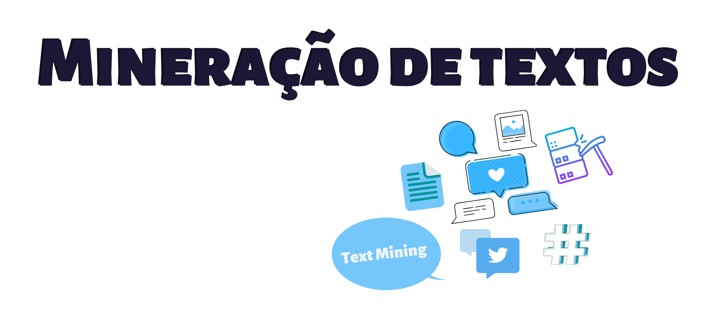
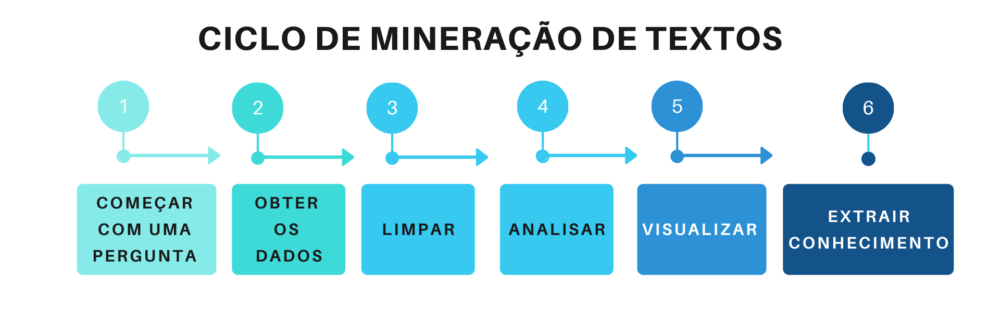

# Mineração de Textos



## O que é Mineração de Textos?

Atualmente, vivemos na era do Big Data, ou seja, estamos gerando dados a todo momento, porém, esses dados, na maioria das vezes, são dados não estruturados, como notícias, emails e documentos de forma geral. E mineração de textos ou do inglês _Text Mining_, é processo utilizado para extrair informações, dessa grande massa de dados.



Agora, que já sabemos que é possível obter informações, de um grande volume de textos, vejamos como é o processo de obtenção dessas informações:

- **Começar com uma pergunta:**
    Primeiramente, devemos ter uma pergunta que queremos responder, como, por exemplo: _O que as pessoas que estão falando sobre data science?_

- **Obter os dados:**
  Agora que já temos uma pergunta, precisamos conseguir os dados que a respondam, sendo assim, irei utilizar como fonte de dados, o que as pessoas estão conversando no Twitter.

- **Limpar:**
  E com os nossos dados em mãos, iremos realizar outra etapa do processo de mineração de dados, que é a limpeza dos nossos dados, removendo caracteres especiais, como acentos, pontuações, colocando todas as palavras em uma só estrutura, como, por exemplo, maiúsculo ou minúsculo e remover todas as palavras de ligação, conhecidas como **stopwords**, como: _a, e, os, de, com, etc_. Que serão irrelevantes para a pergunta que queremos responder.
  
- **Analisar:**
  Com os nossos dados prontos, iremos realizar uma das partes mais divertidas, que é analisar os nossos dados, onde iremos aplicar diversas técnicas e verificar se com o dados que possuímos, poderemos responder à pergunta que nos motivou a analisar esses dados.

- **Visualizar:**
  Nessa etapa, poderemos visualizar o resultado da nossa análise e assim gerar diversas opções de gráficos, como, por exemplo, nuvem de palavras.

- **Extrair conhecimento:**
  E após, seguirmos, todas as etapas, chegaremos a última, onde iremos reponder a nossa pergunta e assim gerar um conhecimento em relação aos dados que posuímos.
  

Chegou o momento mais divertido onde iremos criar um projeto de text mining, e para isso, utilizaremos a linguagem de programação [R](https://cran.r-project.org/) e os seguintes pacotes:

- _'rtweet'_ para conectarmos a api do Twitter.
- _'tm'_ para realizarmos a mineração dos textos.
- _'wordcloud'_ para criarmos nuvens de palavras.
- _'tydeverse'_ para facilitar a manipulação dos nossos dados.
  

Primeiramente, vamos instalar os pacotes que serão necessários durante o projeto e para isso vamos utilizar a função _'install.packages()'_:

```{r eval=FALSE}
install.packages("rtweet")
install.packages("tm")
install.packages("wordcloud")
install.packages("tidyverse")
```

E com os pacotes instalados, devemos carregar os mesmos e assim poderemos utilizar as funções desses pacotes.

```{r eval=FALSE}
library(tm)
library(rtweet)
library(wordcloud)
library(tidyverse)
```

Precisaremos de dados e vamos coletar esses dados utilizando a API do Twitter, utilizar a função de busca _'search_tweets()'_, passando a # que iremos buscar, o número de tweets, onde o número máximo é 18 mil, informamos que não queremos os retweets e languagem dos tweets deverá ser em inglês. 

```{r eval=FALSE}
datascience_tweet <- search_tweets(
  "#datascience",
  n = 18000,
  include_rts = FALSE,
  lang = "en"
)
```

E essas são as primeiras linhas da busca utilizando a API:
```{r eval=TRUE, echo=FALSE,cache=FALSE,  comment=FALSE, warning=FALSE,message=FALSE}
library(DT)
library(tidyverse)
head_tweets <- readRDS("dados/head_datascience_tweet.rds")
  DT::datatable(
      head_tweets, rownames = FALSE,
      selection = 'single',
      escape = FALSE,
      extensions = 'Scroller',
      options = list(language = list(url = '//cdn.datatables.net/plug-ins/1.10.11/i18n/Portuguese-Brasil.json'),
                     pageLength = 20,
                     dom = 't',
                     scrollY = 290,
                     scrollX = TRUE,
                     scroller = TRUE
      )
    )
```

Visualizando a frequência de tweets utilizando #datascience, no intervalo de 1 hora:

```{r eval=FALSE}
datascience_tweet %>% 
  ts_plot("3 hours") +
  ggplot2::theme_minimal() +
  ggplot2::theme(plot.title = ggplot2::element_text(face = "bold")) +
  ggplot2::labs(
    x = NULL, y = NULL,
    title = "Frequência de #datascience no Twitter",
    subtitle = "Tweets no intervalo de 3 horas",
    caption = "\nSource: Dados coletados do Twitter's REST API via rtweet"
  )
```

