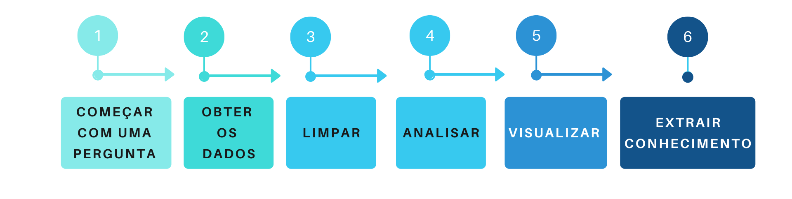

# Mineração de Textos


## O que é mineração de texto?

Atualmente, vivemos na era do Big Data, ou seja, estamos gerando dados a todo momento, porém, esses dados, na maioria das vezes, são dados não estruturados, como notícias, emails e documentos de forma geral. E mineração de textos ou do inglês _Text Mining_, é processo utilizado para extrair informações, dessa grande massa de dados.



Agora, que já sabemos que é possível obter informações, de um grande volume de textos, vejamos como é o processo de obtenção dessas informações. Primeiramente, devemos ter uma pergunta que queremos responder, como no exemplo que irei utilizar nesse seminário, que é, _O que as pessoas que estão falando sobre data science?_, agora que já temos uma dúvida, precisamos conseguir os dados que respondam a nossa pergunta, sendo assim, irei utilizar como fonte de dados, o que as pessoas estão conversando no twitter e com os nossos dados em mãos, iremos realizar outra etapa do processo de mineração de dados, que é a limpeza dos nossos dados, removendo caracteres especiais, como acentos e pontos, colocando todas as palavras em uma só estrutura, como por exemplo, tudo em minusculo e remover todas palavras de ligação, conhecidas como stopwords, como por exemplo: a, e, os, de, com, etc. Que serão irrelevantes para a pergunta que queremos responder.

**Instalando os pacotes necessários:**

```{r eval=FALSE}
install.packages("tm")
install.packages("rtweet")
install.packages("wordcloud")
install.packages("tidyverse")
```

**Carregando os pacotes:**

```{r eval=FALSE}
library(tm)
library(rtweet)
library(wordcloud)
library(tidyverse)
```

**Buscando os dados no Twitter:**

```{r eval=FALSE}
datascience_tweet <- search_tweets(
  "#datascience",
  n = 18000,
  include_rts = FALSE,
  lang = "en"
)
```

**Visualizando a frequência de tweets, em um intervalo de tempo:**

```{r eval=FALSE}
datascience_tweet %>% 
  ts_plot("3 hours") +
  ggplot2::theme_minimal() +
  ggplot2::theme(plot.title = ggplot2::element_text(face = "bold")) +
  ggplot2::labs(
    x = NULL, y = NULL,
    title = "Frequência de #datascience no Twitter",
    subtitle = "Tweets no intervalo de 3 horas",
    caption = "\nSource: Dados coletados do Twitter's REST API via rtweet"
  )
```
