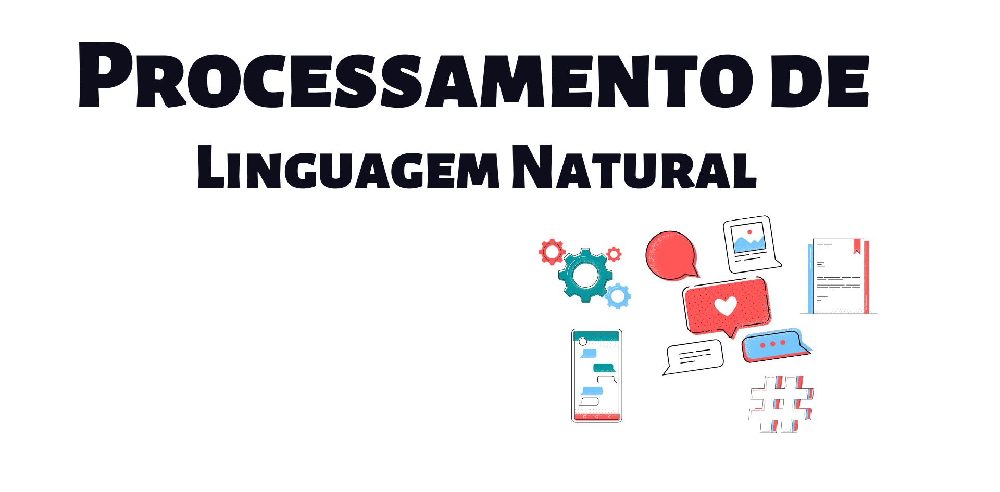

# Processamento de Linguagem Natural



Enquanto, mineração de texto, busca extrair informação de grandes volumes de textos, processamento de linguagem natural, procura fazer com que os computadores consigam entender ou produzir linguagem natural, que é a linguagem que nós humanos utilizamos para nos comunicar. Existem varias aplicações de processamento de linguagem natural, como, por exemplo:

- **Tradução:** O google translate, ou outros aplicativos de tradução.
- **Análise de sentimentos:** Onde é possível identificar, por exemplo, se uma campanha de marketing foi recebida de forma positiva ou não, analisando os comentários das pessoas.
- **Reconhecimento de fala:** As assistentes de voz, como a Siri ou o Google Assistente.
- **Sintetização de fala:** O GPS que fala se você deve ir para direita ou esquerda.
- **Respostas a perguntas:** Chatbots, onde algumas empresas estão utilizando como primeiro contato ao cliente.

Esses foram somente, alguns exemplos das possibilidades de utilização do processamento de linguagem natural.

## Conceitos:
Precisamos, entender alguns conceitos do processamento de linguagem natural, para, quando chegar o momento de construirmos um projeto, ficar mais simples de assimilar algumas coisas que serão feitas.

- **Corpus:** Conjunto de textos.

- **Annotations:** Processo de adicionar anotações no texto, como flexões, dependências e etc.

- **Tokenization:** Dividir o corpus em uma sequência de palavras, pontos e etc, que são conhecidos como **tokens**.

- **Parts-of-Speech Tagging:** Também conhecido como POS Tagging, adiciona tags a cada token, como, por exemplo: verbo, substativo, adjetivo e etc.

- **Lemmatizing ou Lemma:** Transforma a palavra na sua flexão.

- **Dependency Parsing:** Encontra relação entre palavras "pais" e "filhos".


## Código exemplo

Para exemplificar uma utilização do PLN, tentaremos responder a seguinte pergunta, "Qual é o sentimento das pessoas em relação a economia?", agora, que já definimos, algo, que tentaremos responder, precisaremos de dados, e utilizaremos os comentários do Twitter, como fonte desses dados.
O projeto de exemplificação será construido utilizando a linguagem [R](cran.r) e será necessário ter os seguintes pacotes instalados em seu computador:

- _'tydeverse'_ É um pacote, que possui um coleção de pacotes inclusos, para ajudar na manipulação dos dados.
- _'rtweet'_ É um pacote, que permitirá que você se conecte ao Twitter, caso você tenha uma conta, onde você poderá realizar buscas, com no máximo 18 mil tweets.
- _'tm'_ O pacote tm de "Text Mining" é um pacote utilizado para trabalharmos textos.
- _'wordcloud'_ É um pacote que nos permite visualizar de forma rápida, as palavras, utilizando como critério de tamanho, a frequência.
- _'syuzhet'_ É um pacote, que utilizaremos para classificar as sentimentos.

```{r eval=FALSE}
# Instalando os pacotes
install.packages("tydeverse")
install.packages("rtweet")
install.packages("tm")
install.packages("wordcloud")
install.packages("syuzhet")
```

Vamos carregar os pacotes.

```{r eval=FALSE}
# Carregando os pacotes
library(tydeverse)
library(rtweet)
library(tm)
library(wordcloud)
library(syuzhet)
```

Após carregarmos os pacotes em nosso computador, vamos buscar os textos, utilizando a função **search_tweets** do pacote _rtweet_, onde utilizaremos como amostra 2 mil tweets e esses tweets estarão em inglês.

```{r eval=FALSE}
# Buscando tweets relacionados a economia
economia_tweets <- search_tweets(
  "#economy",
  n = 1500,
  include_rts = FALSE,
  lang = "en"
)
```

Visualizando o uso dessa _#_ em um intervalo de 1 hora.

```{r eval=FALSE}
# Gerando um gráfico com a frequência dos tweets no intervalo de 1 hora
economia_tweets %>% 
  ts_plot("1 hours") +
  ggplot2::theme_minimal() +
  ggplot2::theme(plot.title = ggplot2::element_text(face = "bold")) +
  ggplot2::labs(
    x = NULL, y = NULL,
    title = "Frequência de #economy no Twitter",
    subtitle = "Tweets no intervalo de 1 hora",
    caption = "\nSource: Dados coletados do Twitter's REST API via rtweet"
  )
```

Agora, iniciaremos o pré-processamento do nosso texto e para simplificar o nosso trabalho, vamos separar a coluna _'text'_ em uma variável.

```{r eval=FALSE}
# Separando o texto
economia_text <- economia_tweets$text
```

Para fazer a limpeza dos nossos textos podemos utilizar as funções do pacote _tm_, ou você pode criar as suas próprias funções, como, no exemplo abaixo:

```{r eval=FALSE}
# Função para limpeza dos textos
limpar_texto <- function(texto) {
  # Convertendo o texto para minúsculo
  texto <- tolower(texto)
  # Removendo o usuário adicionado no comentário
  texto <- gsub("@\\w+", "", texto)
  # Removendo as pontuações
  texto <- gsub("[[:punct:]]", "", texto)
  # Removendo links
  texto <- gsub("http\\w+", "", texto)
  # Removendo tabs 
  texto <- gsub("[ |\t]{2,}", "", texto)
  # Removendo espaços no início do texto
  texto <- gsub("^ ", "", texto)
  # Removendo espaços no final do texto
  texto <- gsub(" $", "", texto)
  return(texto)
}
```

Utilizando a função criada para limpar o texto.

```{r eval=FALSE}
# Limpando os textos
economia_text <- limpar_texto(economia_text)
```

Mas, ainda utilizaremos o pacote _tm_ para remover as _stopwords_ dos textos, então iremos tranformar o nosso texto limpo anteriormente em um _corpus_ e posteriormente removeremos as _stopwords_.

```{r eval=FALSE}
# Convertendo os textos em corpus
economia_corpus <- VCorpus(VectorSource(economia_text))

# Removendo stopwords
economia_corpus <-  economia_corpus %>% tm_map(removeWords, stopwords("english"))
```
 
Após, a limpeza, poderemos visualizar os nossos textos em uma nuvem de palavras, para descobrirmos os termos mais frequentes do nosso conjunto de dados.

```{r eval=FALSE}
# Lista de cores em hexadecimal
paleta <- brewer.pal(8, "Dark2")

wordcloud(
  economia_corpus,
  min.freq = 15,
  max.words = 250,
  random.order = F,
  colors = paleta
)
```

Agora, transformaremos o nosso _corpus_ em uma _matriz de documentos-termos_, para assim criarmos um gráfico de barras com os termos e sua frequência. 

```{r eval=FALSE}
# Lista de cores em hexadecimal
# Transformando o corpus em matriz de documentos-termos
economia_doc <-  DocumentTermMatrix(economia_corpus)

# Removendo os termos menos frequentes
economia_doc1 <- removeSparseTerms(economia_doc, 0.97)


# Gerando uma matrix ordenada, com o termos mais frequentes
economia_freq <- 
  economia_doc1 %>% 
  as.matrix() %>% 
  colSums() %>% 
  sort(decreasing = T)


# Criando um dataframe com as palavras mais frequentes
df_economia_freq <- data.frame(
  word = names(economia_freq),
  freq = economia_freq
)


# Gerando um gráfico da frequência
df_economia_freq %>%
  filter(!word %in% c("economy")) %>% 
  subset(freq > 50) %>%
  ggplot(aes(x = reorder(word, freq),
             y = freq)) +
  geom_bar(stat = "identity", fill='#0c6cad', color="#075284") +
  theme(axis.text.x = element_text(angle = 45, hjus = 1)) +
  ggtitle("Termos relacionados a Economia mais frequentes no Twitter") +
  labs(y = "Frequência", x = "Termos") +
  coord_flip()

```

Criando um _dendograma_, que é um diagrama de árvore, onde será possível visualizar o agrupamento dos nossos termos.

```{r eval=FALSE}
# Dendograma -> Visualizando os grupos
distancia <- dist(t(economia_doc1), method = "euclidian")
dendograma <- hclust(d = distancia, method = "complete")
plot(dendograma, habg = -1, main = "Dendograma Tweets Economia",
     xlab = "Distância",
     ylab = "Altura")

```


Agora, realizaremos a _análise de sentimentos_, dos nossos tweets e para tal análise utilizaremos a função _get_nrc_sentiment_ do pacote _syuzhet_, onde passaremos como parametro, os termos da nossa _matriz de documentos-termos_. E após, obtermos as emoções dos nossos termos, faremos o calculo da frequência dos sentimentos que utilizaram a **#economy**.

```{r eval=FALSE}
# Obtendo os emoções
economia_sentimento <- get_nrc_sentiment(
  economia_doc$dimnames$Terms,
  language = "english"
)

# Calculando a frequência dos sentimentos
economia_sentimento_freq <- economia_sentimento %>%
  colSums() %>% 
  sort(decreasing = T)

```


