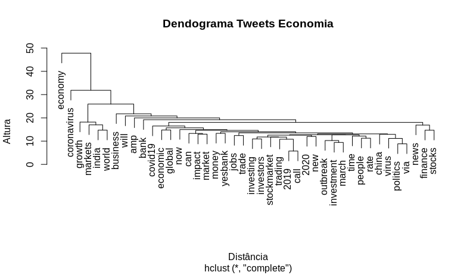

# Processamento de Linguagem Natural


Enquanto, mineração de texto, busca extrair informação de grandes volumes de textos, processamento de linguagem natural, procura fazer com que os computadores consigam entender ou produzir linguagem natural, que é a linguagem que nós humanos utilizamos para nos comunicar. Existem varias aplicações de processamento de linguagem natural, como, por exemplo:

- **Tradução:** O google translate, ou outros aplicativos de tradução.
- **Análise de sentimentos:** Onde é possível identificar, por exemplo, se uma campanha de marketing foi recebida de forma positiva ou não, analisando os comentários das pessoas.
- **Reconhecimento de fala:** As assistentes de voz, como a Siri ou o Google Assistente.
- **Sintetização de fala:** O GPS que fala se você deve ir para direita ou esquerda.
- **Respostas a perguntas:** Chatbots, onde algumas empresas estão utilizando como primeiro contato ao cliente.

Esses foram somente, alguns exemplos das possibilidades de utilização do processamento de linguagem natural.

## Código exemplo

Para exemplificar uma utilização do PLN, tentaremos responder a seguinte pergunta, "Qual é o sentimento das pessoas em relação a economia?", agora, que definimos, algo, que tentaremos responder, precisaremos de dados, e utilizaremos os comentários do Twitter, como fonte desses dados.
O projeto de exemplificação será construido utilizando a linguagem [R](cran.r) e será necessário ter os seguintes pacotes instalados em seu computador:

- _'tydeverse'_ É um pacote, que possui uma coleção de pacotes inclusos, para ajudar na manipulação dos dados.
- _'rtweet'_ É um pacote, que permitirá que você se conecte ao Twitter, caso você tenha uma conta, onde você poderá realizar buscas, com no máximo 18 mil tweets.
- _'tm'_ O pacote tm de "Text Mining" é um pacote utilizado para trabalharmos com textos.
- _'wordcloud'_ É um pacote que nos permite visualizar de forma rápida, as palavras, utilizando como critério de tamanho, a frequência.
- _'syuzhet'_ É um pacote, que utilizaremos para classificar os sentimentos.

```{r eval=FALSE}
# Instalando os pacotes
install.packages("tydeverse")
install.packages("rtweet")
install.packages("tm")
install.packages("wordcloud")
install.packages("syuzhet")
```

Vamos carregar os pacotes.

```{r eval=FALSE}
# Carregando os pacotes
library(tydeverse)
library(rtweet)
library(tm)
library(wordcloud)
library(syuzhet)
```

Após carregarmos os pacotes em nosso computador, vamos buscar os textos, utilizando a função **search_tweets** do pacote _rtweet_, onde utilizaremos como amostra 2 mil tweets e esses tweets estarão em inglês.

```{r eval=FALSE}
# Buscando tweets relacionados a economia
economia_tweets <- search_tweets(
  "#economy",
  n = 2000,
  include_rts = FALSE,
  lang = "en"
)
```

Agora, iniciaremos o pré-processamento do nosso texto e para simplificar o nosso trabalho, vamos separar a coluna _'text'_ em uma variável.

```{r eval=FALSE}
# Separando o texto
economia_text <- economia_tweets$text
```

Para fazer a limpeza dos nossos textos podemos utilizar as funções do pacote _tm_, ou você pode criar as suas próprias funções, como, no exemplo abaixo:

```{r eval=FALSE}
# Função para limpeza dos textos
limpar_texto <- function(texto) {
  # Convertendo o texto para minúsculo
  texto <- tolower(texto)
  # Removendo o usuário adicionado no comentário
  texto <- gsub("@\\w+", "", texto)
  # Removendo as pontuações
  texto <- gsub("[[:punct:]]", "", texto)
  # Removendo links
  texto <- gsub("http\\w+", "", texto)
  # Removendo tabs 
  texto <- gsub("[ |\t]{2,}", "", texto)
  # Removendo espaços no início do texto
  texto <- gsub("^ ", "", texto)
  # Removendo espaços no final do texto
  texto <- gsub(" $", "", texto)
  return(texto)
}
```

Utilizando a função criada para limpar o texto.

```{r eval=FALSE}
# Limpando os textos
economia_text <- limpar_texto(economia_text)
```

Mas, ainda utilizaremos o pacote _tm_ para remover as _stopwords_ dos textos, então tranformaremos o nosso texto limpo anteriormente em um _corpus_ e posteriormente removeremos as _stopwords_.

```{r eval=FALSE}
# Convertendo os textos em corpus
economia_corpus <- VCorpus(VectorSource(economia_text))

# Removendo stopwords
economia_corpus <-  economia_corpus %>% tm_map(removeWords, stopwords("english"))
```
 
Após, a limpeza, poderemos visualizar os nossos textos em uma nuvem de palavras, para descobrirmos os termos mais frequentes do nosso conjunto de dados.

```{r eval=FALSE}
# Lista de cores em hexadecimal
paleta <- brewer.pal(8, "Dark2")

wordcloud(
  economia_corpus,
  min.freq = 15,
  max.words = 250,
  random.order = F,
  colors = paleta
)
```


Agora, transformaremos o nosso _corpus_ em uma _matriz de documentos-termos_, para assim criarmos um gráfico de barras com os termos e sua frequência. 

```{r eval=FALSE}
# Lista de cores em hexadecimal
# Transformando o corpus em matriz de documentos-termos
economia_doc <-  DocumentTermMatrix(economia_corpus)

# Removendo os termos menos frequentes
economia_doc1 <- removeSparseTerms(economia_doc, 0.97)


# Gerando uma matrix ordenada, com o termos mais frequentes
economia_freq <- 
  economia_doc1 %>% 
  as.matrix() %>% 
  colSums() %>% 
  sort(decreasing = T)


# Criando um dataframe com as palavras mais frequentes
df_economia_freq <- data.frame(
  word = names(economia_freq),
  freq = economia_freq
)


# Gerando um gráfico da frequência
df_economia_freq %>%
  filter(!word %in% c("economy")) %>% 
  subset(freq > 50) %>%
  ggplot(aes(x = reorder(word, freq),
             y = freq)) +
  geom_bar(stat = "identity", fill='#0c6cad', color="#075284") +
  theme(axis.text.x = element_text(angle = 45, hjus = 1)) +
  ggtitle("Termos relacionados a Economia mais frequentes no Twitter") +
  labs(y = "Frequência", x = "Termos") +
  coord_flip()

```


<!--  -->

Criando um _dendrograma_, que é um diagrama de árvore, onde será possível visualizar o agrupamento dos nossos termos.

```{r eval=FALSE}
# Dendrograma -> Visualizando os grupos
distancia <- dist(t(economia_doc1), method = "euclidian")
dendrograma <- hclust(d = distancia, method = "complete")
plot(dendrograma, habg = -1, main = "Dendrograma Tweets Economia",
     xlab = "Distância",
     ylab = "Altura")

```



Agora, realizaremos a _análise de sentimentos_, dos nossos tweets e para tal análise utilizaremos a função _get_nrc_sentiment_ do pacote _syuzhet_, onde passaremos como parametro, os termos da nossa _matriz de documentos-termos_. E após, obtermos as emoções dos nossos termos, faremos o calculo da frequência dos sentimentos que utilizaram a **#economy**.

```{r eval=FALSE}
# Obtendo os emoções
economia_sentimento <- get_nrc_sentiment(
  economia_doc$dimnames$Terms,
  language = "english"
)

# Calculando a frequência dos sentimentos
economia_sentimento_freq <- economia_sentimento %>%
  colSums() %>% 
  sort(decreasing = T)

```

Com a frequência dos nossos sentimentos calculados, poderemos visualizar o resultado, mas antes, iremos traduzir os sentimentos do inglês para o português e tranformar o resultado em um dataframe para posterirmente gerarmos o gráfico.

```{r eval=FALSE}
# Criando um dataframe com os sentimentos traduzidos, que será utilizado como de-para. 
sentimetos_traducao <- 
    data.frame(
      sentiment = c(
        "positive",
        "negative",
        "trust",
        "anticipation",
        "fear",
        "joy",
        "sadness",
        "surprise",
        "anger",
        "disgust"
      ),
      sentimentos = c(
        "Positivo",
        "Negativo",
        "Confiança",
        "Antecipação",
        "Medo",
        "Alegria",
        "Tristeza",
        "Surpresa",
        "Raiva",
        "Nojo"
      )
    )
  
# Tranformando os resultados da frequência em um dataframe 
# e juntando ao dataframe de tradução
df_sentimento <- 
  data.frame(
    sentiment = names(economia_sentimento_freq),
    freq = economia_sentimento_freq
  ) %>% 
  left_join(sentimetos_traducao, by = "sentiment") %>% 
  dplyr::select(-sentiment) %>% 
  arrange(desc(freq))


# Visualizando a frequência dos sentimentos em relação a #economy
ggplot(data = df_sentimento,
           aes(x = reorder(sentimentos, -freq), y = freq)) +
    geom_bar(aes(fill=sentimentos), stat = "identity") +
    theme(legend.position = "none",
          axis.text.x = element_text(angle = 45, hjus = 1)) +
    xlab("Sentimentos") +
    ylab("Frequência") +
    ggtitle(titulo)

```


