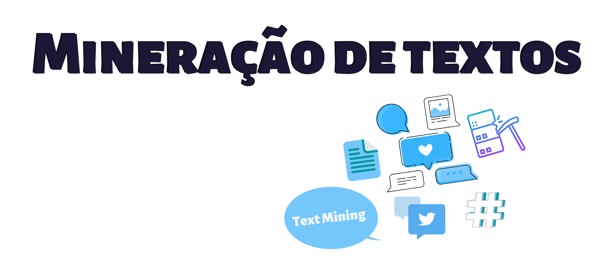
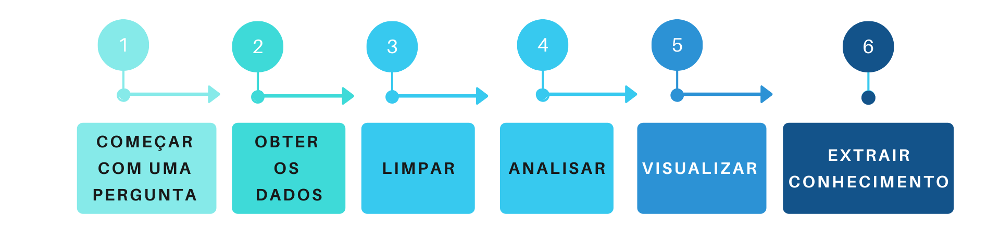
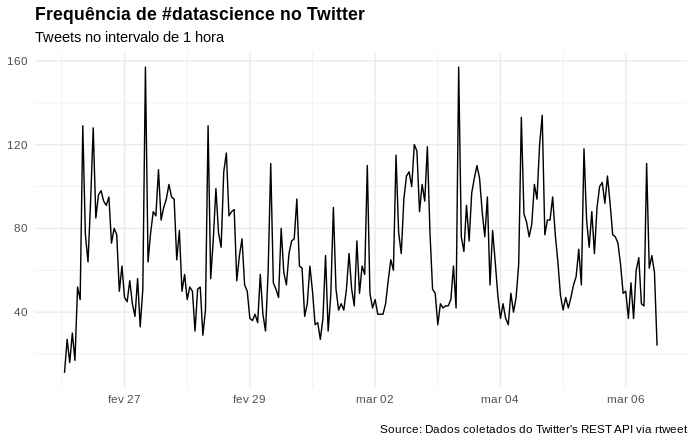
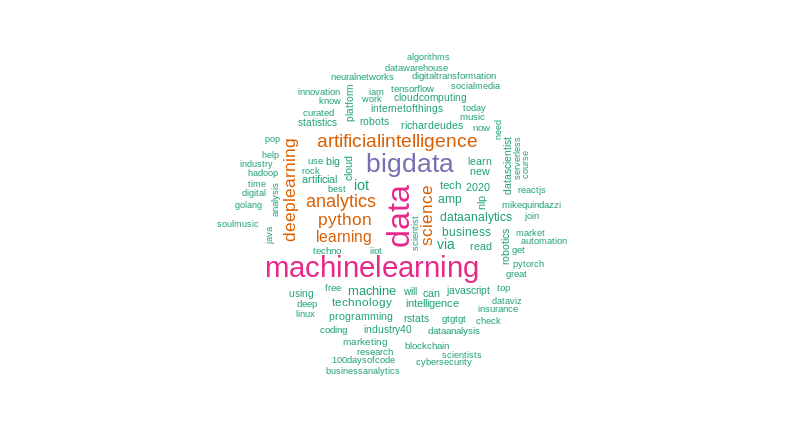
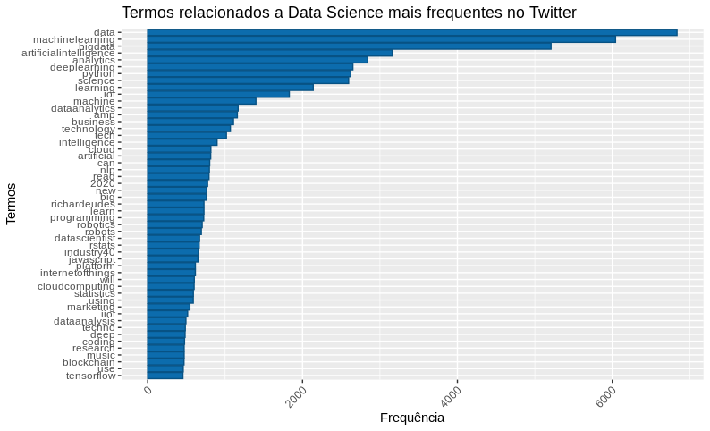
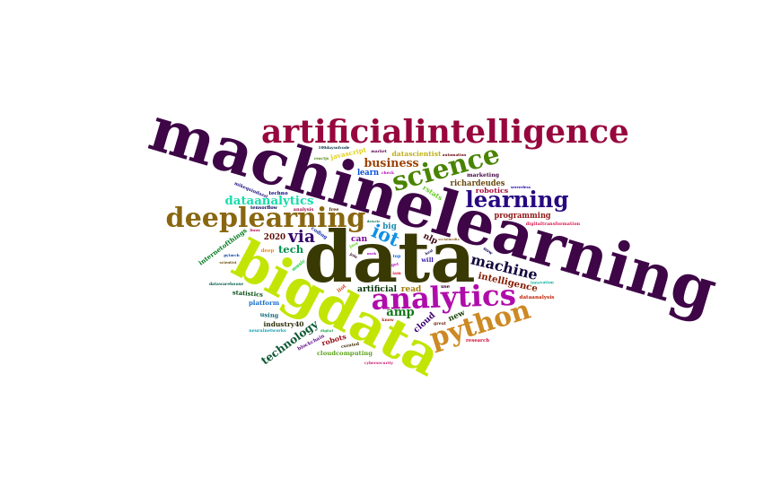
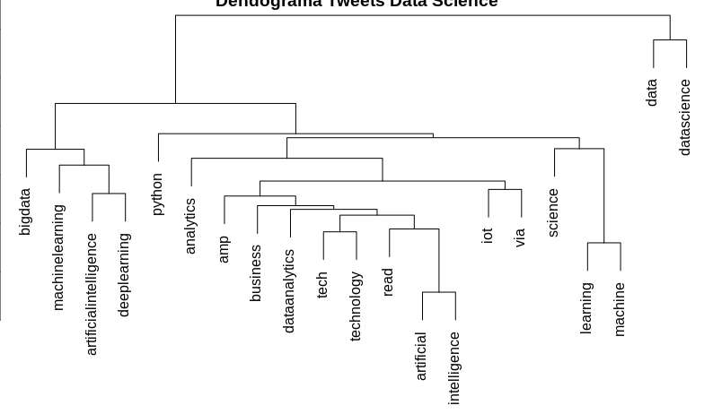

--- 
title: "Processamento de Linguagem Natural"
author: "Valéria Nicéria"
date: "`r Sys.Date()`"
site: bookdown::bookdown_site
documentclass: book
bibliography: [book.bib, packages.bib]
biblio-style: apalike
link-citations: yes
---
# Mineração de Textos



Atualmente, vivemos na era do Big Data, ou seja, estamos gerando dados a todo momento, porém, na maioria das vezes, são dados não estruturados, como notícias, e-mails e documentos de forma geral. Mineração de textos ou do inglês _Text Mining_, tem como objetivo, encontrar termos relevantes e estabelecer relacionamento entre eles de acordo com a sua frequência e assim extrair informações de grandes volumes de textos.

## Workflow



Agora, que sabemos que é possível obter informações, de grandes volumes de textos, vejamos como é o processo de obtenção dessas informações:

- **Começar com uma pergunta:**
  Primeiramente, devemos ter um problema que queremos resolver, ou uma pergunta que desejamos responder, como, por exemplo: _O que as pessoas que estão falando sobre data science?_

- **Obter os dados:**
  Agora, que temos um questionamento, precisamos conseguir os dados que o responda, sendo assim, utilizarei como fonte de dados, o que as pessoas estão conversando no Twitter.

- **Limpar:**
  E com os nossos dados em mãos, iremos realizar outra etapa do processo, que é a limpeza dos nossos dados, removendo caracteres especiais, como acentos, pontuações, tranformando todas as palavras em uma só estrutura, como, minúsculo e removeremos todas as **stopwords**, que são palavras irrelevantes para a pergunta que queremos responder.
  
- **Analisar:**
  Com os nossos dados prontos, iremos realizar uma das partes mais divertidas, que é analisar os nossos dados, onde poderemos aplicar diversas técnicas e verificar se com o dados que possuímos, responderemos à pergunta que nos motivou a analisar esses dados.

- **Visualizar:**
  Nessa etapa, poderemos visualizar o resultado da nossa análise e assim gerar diversas opções de gráficos, como, por exemplo, nuvem de palavras.

- **Extrair conhecimento:**
  E chegamos a última, e se tudo estiver ocorrido bem, durante o processo de análise, teremos transformado os nossos dados em informação e agregando ao nosso entendimento prévio sobre o assunto, como resultado, gerado um conhecimento novo, sobre o fato que estávamos analisando.
  

## Conceitos

Antes, de continuarmos, vamos conhecer alguns conceitos:
  
- **Corpus:** Conjuntos de textos.
- **Stopwords:** Como comentado anteriormente, são palavras que não adicionam sentido ao texto, como palavras de ligação por exemplo e existem listas de stopwords para vários idiomas na internet.

## Código exemplo

Chegou o momento mais divertido onde criaremos um projeto básico de text mining, e para isso, utilizaremos a linguagem de programação [R](https://cran.r-project.org/) e os seguintes pacotes:

- _'rtweet'_ É um pacote, que permitirá que você se conecte ao Twitter, caso você tenha uma conta, onde você poderá realizar buscas, com no máximo 18 mil tweets.
- _'tm'_ O pacote tm de "Text Mining" é um pacote utilizado para trabalharmos com textos.
- _'wordcloud'_ É um pacote que nos permite visualizar de forma rápida, as palavras, utilizando como critério de tamanho, a frequência.
- _'tydeverse'_ É um pacote, que possui uma coleção de pacotes inclusos, para ajudar na manipulação dos dados.
  

Primeiramente, vamos instalar os pacotes que serão necessários durante o projeto:

```{r eval=FALSE}
# Instalando os pacotes
install.packages("rtweet")
install.packages("tm")
install.packages("wordcloud")
install.packages("tidyverse")
```

E com os pacotes instalados, devemos carregar os mesmos e assim poderemos utilizar as funções desses pacotes.

```{r eval=FALSE}
# Carregando os pacotes
library(tm)
library(rtweet)
library(wordcloud)
library(tidyverse)
```

Precisaremos de dados e vamos coletar esses dados utilizando a API do Twitter, usando a função de busca _'search_tweets()'_, passaremos a **#** que iremos buscar, o número de tweets, onde o número máximo é 18 mil, informaremos que não queremos os retweets e a linguagem dos tweets deverá ser em inglês.

```{r eval=FALSE}
# Buscando os tweets com a #datascience
datascience_tweet <- search_tweets(
  "#datascience",
  n = 18000,
  include_rts = FALSE,
  lang = "en"
)
```

E essas são as primeiras linhas da busca:

```{r eval=TRUE, echo=FALSE,cache=FALSE,  comment=FALSE, warning=FALSE,message=FALSE}
library(DT)
library(tidyverse)
head_tweets <- readRDS("dados/head_datascience_tweet.rds")
  DT::datatable(
      head_tweets, rownames = FALSE,
      selection = 'single',
      escape = FALSE,
      extensions = 'Scroller',
      options = list(language = list(url = '//cdn.datatables.net/plug-ins/1.10.11/i18n/Portuguese-Brasil.json'),
                     pageLength = 20,
                     dom = 't',
                     scrollY = 290,
                     scrollX = TRUE,
                     scroller = TRUE
      )
    )
```


Visualizando a frequência de tweets utilizando #datascience, no intervalo de 1 hora:

```{r eval=FALSE}
# Gerando um gráfico com a frequencia dos tweets no intervalo de 1 hora
datascience_tweet %>% 
  ts_plot("1 hours") +
  ggplot2::theme_minimal() +
  ggplot2::theme(plot.title = ggplot2::element_text(face = "bold")) +
  ggplot2::labs(
    x = NULL, y = NULL,
    title = "Frequência de #datascience no Twitter",
    subtitle = "Tweets no intervalo de 1 hora",
    caption = "\nSource: Dados coletados do Twitter's REST API via rtweet"
  )
```



Vamos começar a mineração dos textos e para isso iremos pegar a (coluna) _text_ e atribuir a uma variável.
 

```{r eval=FALSE}
# Atribuindo os textos a uma variável
datascience_texto <- datascience_tweet$text
```

Tranformando os nossos textos em um corpus, para assim podermos realizar a limpeza utilizando a função _tm_map_, onde removeremos os caracteres especiais, transformaremos todas as letras para minúsculas, removeremos as pontuações e as stopwords em inglês.

```{r eval=FALSE}
# Transformando os textos em um corpus
datascience_corpus <- VCorpus(VectorSource(datascience_texto))

# Realizando a limpeza do corpus
datascience_corpus <- 
  tm_map(
    datascience_corpus,
    content_transformer(
      function(x) iconv(x, from = 'UTF-8', to = 'ASCII//TRANSLIT')
    )
  ) %>% 
  tm_map(content_transformer(tolower)) %>% 
  tm_map(removePunctuation) %>% 
  tm_map(removeWords, stopwords("english"))
```

Após, realizar a limpeza dos nossos textos, chegou o momento de visualizar o resultado em uma nuvem de palavras e iremos utilizar a função _brewer.pal_, para gerar as cores em hexadecimal, para assim, colorirmos a nossa nuvem.

```{r eval=FALSE}
# Lista de cores em hexadecimal
paleta <- brewer.pal(8, "Dark2")

# Criando uma nuvem de palavras, com no máximo 100 palavras
# onde tenha se repetido ao menos 2 vezes.
wordcloud(
  datascience_corpus,
  min.freq = 2,
  max.words = 100,
  colors = paleta
)
```


Criando uma matriz de documentos-termos _(DocumentTermMatrix)_, removendo os termos menos frequentes da matriz e somando os termos restantes para assim verificar os termos mais frequentes.

```{r eval=FALSE}
# Criando uma matriz de termos
datascience_document <- DocumentTermMatrix(datascience_corpus)

# Removendo os termos menos frequentes
datascience_doc <- removeSparseTerms(datascience_document, 0.98)

# Gerando uma matrix ordenada, com o termos mais frequentes
datascience_freq <- 
  datascience_doc %>% 
  as.matrix() %>% 
  colSums() %>% 
  sort(decreasing = T)
```

Gerando um dataframe com os termos mais frequentes e visualizando em um gráfico.

```{r eval=FALSE}
# Criando um dataframe com as palavras mais frequentes
df_datascience <- data.frame(
  word = names(datascience_freq),
  freq = datascience_freq
)

# Gerando um gráfico da frequência
df_datascience %>%
  filter(!word %in% c("datascience", "via")) %>% 
  subset(freq > 450) %>% 
  ggplot(aes(x = reorder(word, freq),
             y = freq)) +
  geom_bar(stat = "identity", fill='#0c6cad', color="#075284") +
  theme(axis.text.x = element_text(angle = 45, hjus = 1)) +
  ggtitle("Termos relacionados a Data Science mais frequentes no Twitter") +
  labs(y = "Frequência", x = "Termos") +
  coord_flip()

```



E podemos visualizar o resultado em uma nuvem de palavras, porém utilizaremos outro pacote para gerar a nuvem que é o _wordcloud2_, pois ele gera uma nuvem de palavras mais bonita que o pacote que utilizamos até o momento,  mas antes, temos que instalar o pacote em nosso computador e utilizamos o comando abaixo para realizar a instalação.

```{r eval=FALSE}
# Carregando o pacote 'devtools'
library(devtools)

# Instalando o pacote 'wordcloud2'
devtools::install_github("lchiffon/wordcloud2")

```

E após, instalarmos, carregaremos o pacote _wordcloud2_ e passaremos o nosso dataframe com os termos mais frequentes para a função _wordcloud2_ e teremos como resultado o seguinte gráfico.

```{r eval=FALSE}
# Carregando o pacote 'wordcloud2'
library(wordcloud2)

wordcloud2(data = df_datascience)

```



E podemos visualizar como os nossos termos estão agrupados, e para isso produziremos um dendrograma de agrupamento hierárquico, que é um diagrama de árvore.

```{r eval=FALSE}
# Removendo os termos menos frequentes
datascience_doc1 <- removeSparseTerms(datascience_document, 0.95)

# Clustering 1 = Dendograma
distancia <- dist(t(datascience_doc1), method = "euclidian")
dendograma <- hclust(d = distancia, method = "complete")
plot(dendograma, habg = -1, main = "Dendograma Tweets Data Science",
     xlab = "Distância",
     ylab = "Altura")

```

